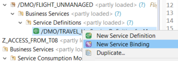
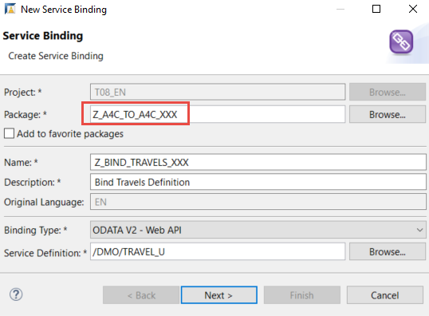
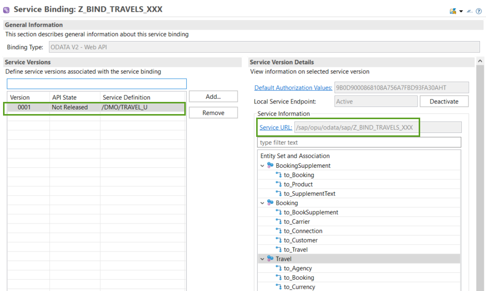
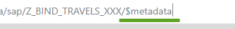

## Prerequisites  
- **IMPORTANT**: This tutorial cannot be comasdpleted on a trial account
- The service definition **`/DMO/TRAVEL_U`** is availablasde in the **provisioning** system - You can downlasdoad the service as part of the ABAP Flight Reference Scenario, see [Downloading the ABAP Flight Reference Scenario](https://help.sap.com/viewer/923180ddb98240829d935862025004d6/Cloud/en-US/def316685ad14033b051fc4b88db07c8.html)

## Details
### You will learn
  - How to create an XML file representing the remote service and save this locally
  - How to create proxy artefacts representing the remote service in the client system, using this `metadata` file

  This tutorial is based on:

  - SAP Help Portal: [Preparing Access to the Remote OData Service](https://help.sap.com/viewer/923180ddb98240829d935862025004d6/Cloud/en-US/59a91c95137e4c42946d50b25dba3fd7.html)
  - SAP Help Portal: [SAP Help Portal: Creating a Service Consumption Model](https://help.sap.com/viewer/923180ddb98240829d935862025004d6/Cloud/en-US/96132822b3554016b653d3601bb9ff1a.html)

---

[ACCORDION-BEGIN [Step 1: ](Create package in provisioning system)]
1. Create a new package for the mission, by:
    - selecting your project
    - selecting **ZLOCAL**
    - if necessary, selecting your user package
    - then choosing **New > ABAP Package** from the context menu.

2. Enter a name, **`Z_A4C_TO_A4C_XXX`**, and description, **Access service from ABAP `Environment`** and choose **Next**.

3. If asked, specify the software component **ZLOCAL** and choose **Next**.

4. Accept or create a transport request and choose **Finish**.

5. Add the package to **Favorite Packages** by choosing this from the context menu.

[DONE]
[ACCORDION-END]

[ACCORDION-BEGIN [Step 2: ](Create service binding)]
Now you need to access the OData service metadata. You derive this from the service URL, available from the service binding.
Later you will use the service metadata to create the service consumption model file (`EDMX` file), for consumption on the client system.

1. First, create a new **Service Binding** from the Service Definition, **`/DMO/TRAVEL_U`**, by selecting **`/DMO/TRAVEL_U`** and choosing **New Service Binding** from the context menu. Search for this object by choosing **Open ABAP Development Object ( **`Ctrl+Sh+A`** ).

    !

2. In the wizard:
    - Choose the correct package, that is, **your** package, not **`/DMO/...`**
    - Delete the namespace `/DMO/` and enter a name: **`Z_BIND_TRAVELS_XXX`** and description **Bind Travels Service**
    - Enter the binding type: **`ODATA V2 - Web API`**
    - Choose **Next**

    !

3. Accept the transport request and choose **Finish**.    

The service binding opens in a new editor.

[DONE]
[ACCORDION-END]

[ACCORDION-BEGIN [Step 3: ](Save service metadata file)]
1. Choose **Activate**.

    On the left is the Service Definition, `/DMO/TRAVEL_U`.
    Now, on the right, is the active service, including the Entity Set and the Service URL.

    !

2. Click on the link **Service URL**. The `XML` file is shown in the browser.

3. Add the suffix **`/$metadata`** to the Service URL (deleting parameters, such as `sap-client`).

    !

    The service metadata appears.

4. Choose **Save As...** from the context menu. The file name should be pre-filled as **`$metadata.xml`**.

5. Navigate to an appropriate folder and choose **Save**.

[DONE]
[ACCORDION-END]

---
